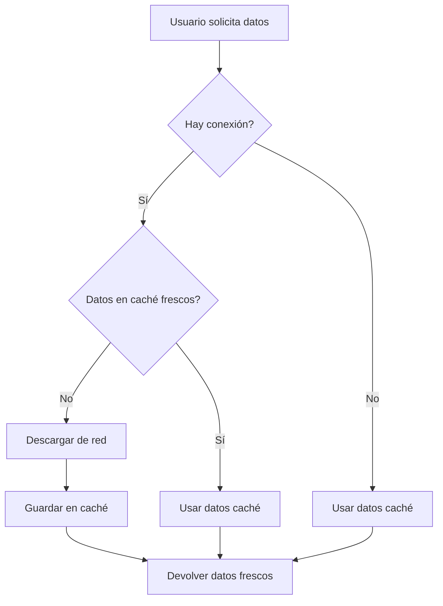

# Implementación de Funcionalidad Offline - Mapa Sur

## Overview

Esta implementación proporciona funcionalidad completa offline para la aplicación Mapa Sur, permitiendo que los usuarios accedan a los datos GeoJSON (`calles.geojson` y `fonavi.geojson`) sin conexión a internet.

## Arquitectura

### Componentes Principales

1. **IndexedDBService** (`src/services/IndexedDBService.ts`)
   - Maneja el almacenamiento local en IndexedDB
   - Proporciona métodos para guardar, recuperar y gestionar datos caché
   - Incluye metadatos como timestamps y versiones

2. **ConnectionService** (`src/services/ConnectionService.ts`)
   - Detecta el estado de conexión del usuario
   - Proporciona información sobre calidad de red
   - Emite eventos cuando cambia el estado de conexión

3. **OfflineDataService** (`src/services/OfflineDataService.ts`)
   - Implementación mejorada del DataService con caché offline
   - Estrategia "Cache First, Network Second"
   - Sincronización automática cuando hay conexión

4. **Componentes UI**
   - `ConnectionStatus`: Indicador visual de estado de conexión
   - `DataStatusNotification`: Notificaciones sobre estado de datos

## Flujo de Datos



## Configuración del Service Worker

Se ha configurado el Service Worker para cachear archivos GeoJSON:

```javascript
{
  urlPattern: /.*\/assets\/.*\.geojson$/i,
  handler: "StaleWhileRevalidate",
  options: {
    cacheName: "geojson-cache",
    expiration: {
      maxEntries: 10,
      maxAgeSeconds: 7 * 24 * 60 * 60, // 7 días
      purgeOnQuotaError: true,
    }
  }
}
```

## Estrategia de Caché

### Política de Almacenamiento

- **Primera carga**: Descargar desde red → guardar en IndexedDB
- **Cargas subsiguientes**: Verificar IndexedDB primero
- **Con conexión**: Comparar timestamps → actualizar si es necesario
- **Sin conexión**: Usar datos caché exclusivamente

### Gestión de Datos Obsoletos

- Los datos se consideran obsoletos después de 24 horas
- Cuando están obsoletos y hay conexión, se actualizan en segundo plano
- Si no hay conexión, se usan datos obsoletos con advertencia

## Componentes de UI

### ConnectionStatus

Muestra información sobre:

- Estado de conexión (online/offline)
- Calidad de red (rápida/media/lenta)
- Estado de caché de datos
- Última sincronización

### DataStatusNotification

Proporciona notificaciones contextuales sobre:

- Datos desactualizados (con opción de actualizar)
- Modo offline activo
- Errores de carga

## Integración con Hooks Existentes

Se han actualizado los hooks existentes para usar el nuevo servicio:

- `useBuildingsData`: Ahora usa `OfflineDataService`
- `useStreetsData`: Ahora usa `OfflineDataService`
- `useDataService`: Enhanced con metadatos de caché

## Características Implementadas

### ✅ Funcionalidad Offline Completa

- Carga de datos sin conexión
- Indicadores visuales de estado
- Transición transparente entre online/offline

### ✅ Sincronización Automática

- Actualización cuando se restaura la conexión
- Verificación de datos obsoletos
- Actualización en segundo plano

### ✅ Gestión de Errores

- Fallback a caché cuando falla la red
- Notificaciones informativas
- Opciones manuales de actualización

### ✅ Optimización de Rendimiento

- Estrategia de caché inteligente
- Detección de calidad de red
- Actualizaciones incrementales

## Uso

### Para el Usuario Final

1. **Primera visita**: Los datos se descargan y guardan automáticamente
2. **Uso offline**: La aplicación funciona normalmente con datos caché
3. **Vuelta a conexión**: Los datos se actualizan automáticamente

### Para Desarrolladores

```typescript
// Usar el servicio offline
import { createDataService } from '../services/OfflineDataService';

const dataService = createDataService();

// Cargar datos con opciones
const buildings = await dataService.loadBuildings({
  forceRefresh: false,
  maxCacheAge: 24 * 60 * 60 * 1000, // 24 horas
  preferOffline: true
});
```

## Configuración

### Variables de Entorno

No se requieren variables de entorno adicionales.

### Dependencias

- IndexedDB API (nativa del navegador)
- Service Worker (configurado via vite-plugin-pwa)
- React Hooks para gestión de estado

## Testing

### Escenarios de Prueba

1. **Sin conexión inicial**: Verificar que los datos no carguen
2. **Con conexión → Sin conexión**: Verificar caché funcional
3. **Sin conexión → Con conexión**: Verificar sincronización
4. **Datos obsoletos**: Verificar actualización en segundo plano

### Herramientas de Desarrollo

- Chrome DevTools → Application → IndexedDB
- Network throttling para simular conexiones lentas
- Offline mode en DevTools

## Consideraciones Futuras

### Posibles Mejoras

1. **Background Sync API**: Para actualizaciones más robustas
2. **Web Workers**: Para procesamiento pesado en background
3. **Compression**: Para reducir tamaño de datos caché
4. **Delta Updates**: Para descargar solo cambios

### Monitoreo

- Implementar analytics de uso offline
- Métricas de rendimiento de caché
- Reporte de errores de sincronización

## Troubleshooting

### Problemas Comunes

1. **Datos no cargan**: Verificar permisos de IndexedDB
2. **Caché no actualiza**: Verificar estado de conexión
3. **Errores de CORS**: Configurar headers adecuados

### Depuración

```javascript
// Verificar estado de caché
const cacheInfo = await dataService.getCacheInfo();
console.log('Cache info:', cacheInfo);

// Forzar actualización
await dataService.refreshCache();
```

## Conclusión

Esta implementación proporciona una experiencia de usuario robusta y transparente, permitiendo el uso completo de la aplicación tanto online como offline, con sincronización automática y gestión inteligente de datos caché.
